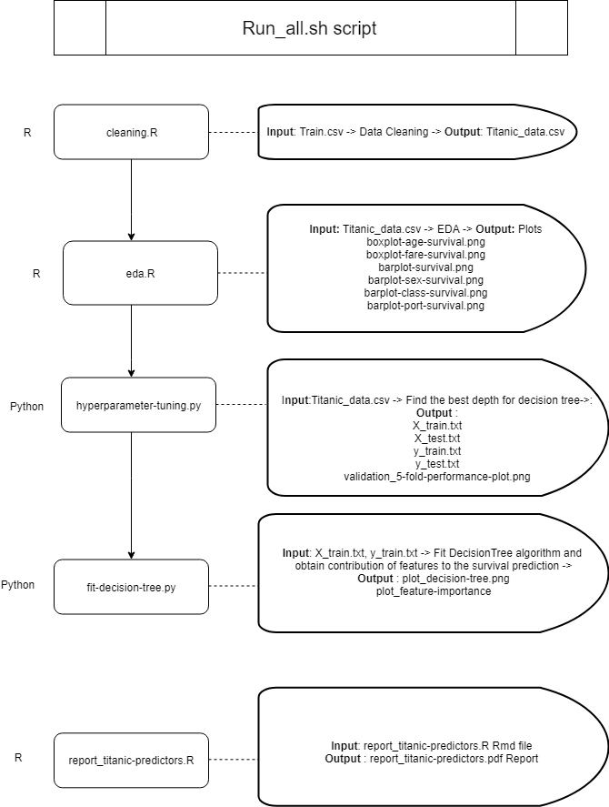

# Predictors of Survival for Titanic Passengers

Team members:  
Alden Chen (aldenchen)  
Birinder Singh (birinder1469)    

## Question
What are the two strongest predictors of survival for Titanic passengers?

## Analysis

The target variable for the analysis is Survived, a dummy variable that takes the value 0 if the passenger did not survive and
1 is he or she did survive. We have data on 712 passengers for these seven features :

|Feature	           |Description	                                    |
|--------------------|-------------------------------------------------|
|Passenger Class	   |First, Second or Third Class |
|Sex	               |Male or Female |    
|Age                 |Age of each passenger years	|
|Siblings/Spouses	   |Number of siblings and spouses aboard the Titanic |
|Parents/Children	   |Number of parents and children aboard the Titanic |
|Fare	               |The amount each passenger paid for a his or her ticket |

We perform some exploratory data analysis to visualize the relationships between different features and the chances of survival. To find the optimal tree, we use 5-fold cross validation to find the optimal depth decision tree. We fit a decision tree with this depth and use the `feature_importances_` attribute to determine which two features are the best predictors of survival. We conclude that the two best predictors of survival for Titanic passengers are sex and passenger class.

## Usage

This analysis uses 4 scripts which need to be run in the following order to execute the analysis: 

1. `cleaning.R`, a script to load and clean the data
2. `eda.R`, a script that produces some plots for exploratory data analysis
3. `hyperparameter-tuning.py`, a script that performs 5-fold cross validation to find the best depth for the decision tree, including a plot of the validation performance for different depths
4. `fit-decision-tree.py`, a script that fits a depth-3  decision tree and produces a plot of the `feature_importances_`


To execute this analysis, clone this repository, navigate to the root of this project, and run the following commands in the Unix shell.  

``` sh
Rscript src/cleaning.R 'data/train.csv' 'data/titanic_data.csv'
Rscript src/eda.R 'data/titanic_data.csv' 'results'
python src/hyperparameter-tuning.py 'data/titanic_data.csv' 'data' 'results'
python src/fit-decision-tree.py 'data' 'results'
Rscript -e "rmarkdown::render('doc/report_titanic-predictors.Rmd')"
```

Alternatively, you can just execute the `run_all.sh` script from the command line once you are at the root of the project directory.

```sh
bash run_all.sh
```
The final output is a report in pdf format called `report_titanic-predictors.pdf`. This can be found in the `doc` directory. 

Below is a flowchart with details regarding the inputs and outputs for each script:




## Dependencies

This analysis was developed using R version 3.5  and Python 3.6.  

To run the analysis, the following packages are used in the scripts and should be installed on your computer before running the analysis.


| R     | Python    |
| :------------- | :------------- |
| `ggplot2`       |`` pandas  ``    |
| `tidyverse`       |`` numpy  ``     |
| `grid `    |`` sklearn  ``   |
| `png`       | `argparse `      |
| `gridExtra `      | `graphviz `    |
|       | `matplotlib`       |
|        | `os `     |
