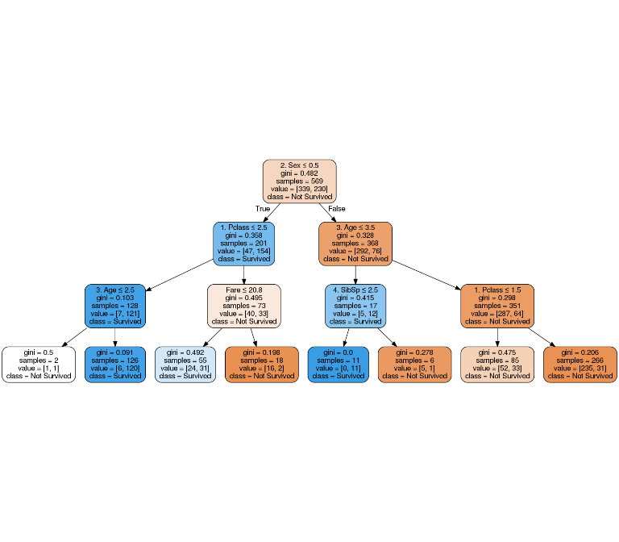

Predictors of Survival for Titanic Passengers
================
Alden Chen, Birinder Singh
2018-12-01

Introduction
------------

What are the two best predictors of survival for Titanic passengers? In this analysis, we look at data on passengers from the Titanic. Using seven features, we fit a decision tree model to answer our question. This question improves our understanding of the dynamics of who survives and who doesn't in maritime tragedies. Understanding these dynamics could be useful for the design of better emergency protocols aboard ships.

Exploratory Data Analysis:
--------------------------

Our target variable is `Survived`, a dummy variable that takes the value `0` if a passenger did not survive and `1` if he or she did survive. We have data on 712 passengers for these seven features

| Feature             | Description                                            | Type of Variable |
|---------------------|--------------------------------------------------------|------------------|
| Passenger Class     | First, Second or Third Class                           | Categorical      |
| Sex                 | Male or Female                                         | Categorical      |
| Age                 | Age of each passenger years                            | Numeric          |
| Siblings/Spouses    | Number of siblings and spouses aboard the Titanic      | Integer          |
| Parents/Children    | Number of parents and children aboard the Titanic      | Integer          |
| Fare                | The amount each passenger paid for a his or her ticket | Numeric          |
| Port of Embarkation | Cherbourg, Queenstown, or Southampton                  | Categorical      |

*Table 1: An overview of the features in the data; gives a brief description and the type of each variable.*

In this section, we look at some plots of the data and discuss their implications for prediction.

 *Figure 1: Bar Plots, Number of Survivors by Passenger Class, Sex, and Port of Embarkation. Bars represent counts of survivors and non-survivors for each feature.*

In the three bar plots above, we compare the number of people who survived based on passengers' sex, port of embarkation, and cabin class. We can see that there appears to be a large difference between the number of passengers that survived based on sex. For female passengers, there are more passengers who survived than passengers than died, while the opposite is true for male passengers. We see a similar trend for cabin class. Among first class passengers, there are more survivors than non-survivors, while among third class passengers, there are many more non-survivors than survivors.This suggests that sex and passenger class could be important features for predicting survival.

For port of embarkation, the vast majority of passengers boarded at Southampton. They appear to have survival rates similar to Queenstown passengers. Cherbourg passengers seem to have a much higher survival rate than passengers who boarded at other ports. However, given the relatively small number of Cherbourg passengers, it is unclear if port of embarkation will be a good predictor of survival.

*Figure 2: Box Plots, Survival vs Age and Survival vs Fare. Five number summaries for age and fare grouped by survival status. Points represent a single observation.*

The box plots above show the distribution of ages and fares of the passengers based on whether or not they survived. There seems to be only a small difference in the ages of passengers who survived and those who did not, so age likely would not be a very important feature for predicting survival.

For fare, it appears that passengers who survived paid higher fares. This is likely related to the trend that there were more first class survivors than second or third class survivors. Presumably, first class passengers paid higher fares, so it is not surprising that survivors, on average, paid higher fares.

Model Development
-----------------

To decide on the appropriate depth of the tree, we used five-fold cross validation. Below is a plot of the validation performance for different depth trees. We can see a clear spike in the average accuracy at a depth of 3.

*Figure 3: Validation Performance. Line represents the average accuracy for different depth trees from five-fold cross validation.*

Below is the final depth-3 decsion tree that was fit on all of the training data.

 *Figure 4: Decision Tree. A graphical representation of the decision tree. Each split is a node in the tree. The features and thresholds used for each split are reported in each node*

Results
-------

After fitting a model of depth three, we looked at the feature importances of our model. The plot below summarizes our results. We can see that the two best predictors of survival for Titanic passengers are sex and passenger class. We can also see this in the plot of the decision tree. The most powerful predictors were split on earlier in the decision tree. The first split is done based on sex. Then in the second level, the tree splits on age and passenger class, which are the next two most important predictors after sex. Also, we see that features with 0 feature importance are not part of the tree at all.

This supports our initial observations from the exploratory plots that we produced, where we noted that female passengers and passengers from first class had higher rates of survival. Taken together, this suggests that being a female and/or a first class passenger aboard the Titanic improved one's chance of survival.

*Figure 5: Feature Importances. Bars represent the feature importance score for that feature obtained from the `feature_importances_` attribute.*

Limitations
-----------

One major limitation of our findings is that the model accuracy was 79% on our test set. We need to take this into consideration when we look at the feature importances. The ranking of features would be more meaningful if our model had more predictive power. Further, decision trees can change from one implementation to another based on changes in data or sometimes randomness. As such, the feature importances could change from one implmentation to another. However, given that the most important feature, sex, had far higher feature importances than any other feature, it seems reasonable to conclude that sex is still an important predictor. Other features all had lower and fairly similar feature importances, so these may not be as meaningful.

Another limitation was the quality of the data set. For over 200 passengers, there were missing features for at least one feature, and we did not include those observations when training or testing the tree. We may have been able to fit a better model if these features were available. Also, our data did not include any information on crew members, who made up a large proportion of people aboard the Titanic. Including the crew members would result in a more complete analysis of the event.

Future Directions
-----------------

One possible idea to explore for future analyses could be feature engineering. Our dataset only had seven features. It may be possible to create some features from one or more of the original features that are better predictors of survival.

It may also be good idea to fit multiple decision trees of the same depth on different partitions of the training set, like in cross validation, when assessing the feature importances. In doing so, we could see how much the feature importances change from one implementation to the next, and compute an average of the importance scores for each feature. An average importance from multiple implementations would likely give us a more robust metric for comparing features. We could also explore using a different measure of importance, such as the Shapley Additive Explanation (SHAP), which can provide a more detailed analysis of how each feature is affecting the prediction.

We could also consider more nuanced metrics of performance, such as precision, recall, or auc, rather than just accuracy when validating the tree and selecting the hyperparameters. This would result in different notions of performance and potentially a different choice of hyperparameter. Also, we could explore using these metrics to tune other hyperparameters of the decision tree, such as `max_features`, `min_samples_split`, and `min_samples_leaf`.

References
----------

Kaggle.(2012). *Titanic: Machine Learning from Disaster* \[Data files and description\]. Retrieved from: <https://www.kaggle.com/c/titanic>

scikit-learn developers. (2018). *sklearn.tree.DecisionTreeClassifier*. Retrieved from:
<https://scikit-learn.org/stable/modules/generated/sklearn.tree.DecisionTreeClassifier.html>
